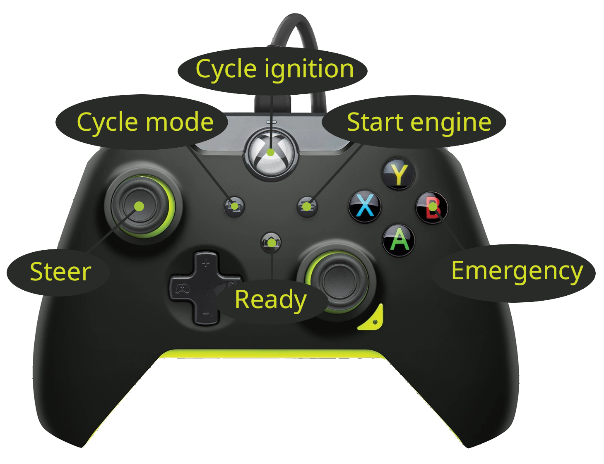
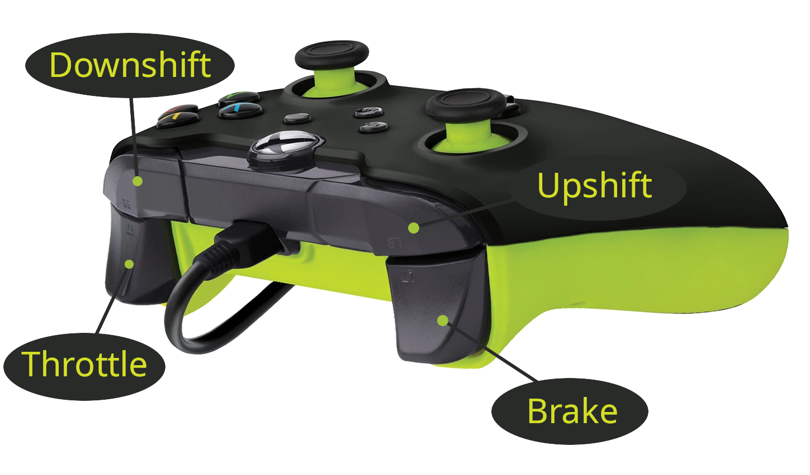

Direct operation
================

The drive-by-wire (DBW) system in OLAV may be operated without its ROS
interface. This is an advanced feature and should only be used by experienced
users, as most safety systems are bypassed when operating the drive-by-wire
directly.

To operate the DBW system directly, ensure you have a connection to the DBW Wago
PLC. Then, launch the Python script provided under `pyolav/`

To avoid accidental consecutive gear switches, the gear switch bumpers have a
long debounding time of 3 seconds.

Controller bindings
-------------------

