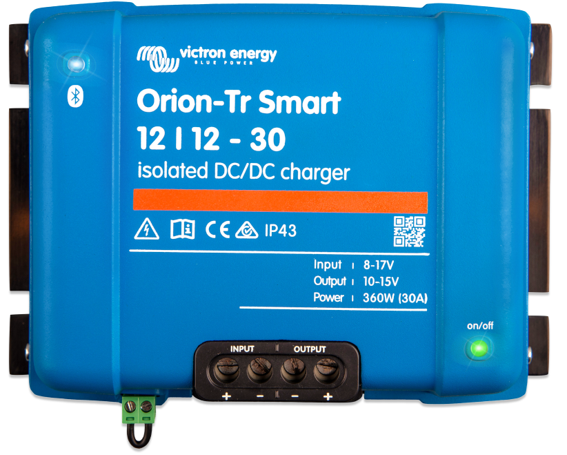
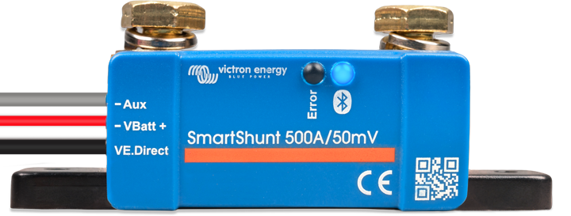
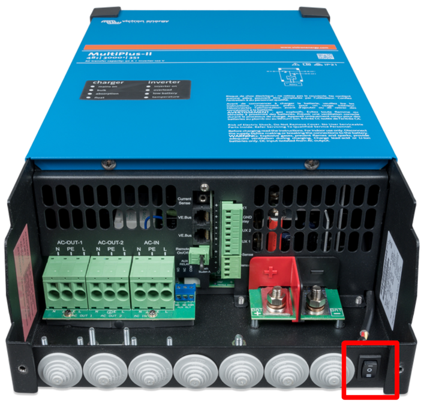

Inverter
========

Components
----------

Orion-Tr Smart Isolated Charger
_______________________________

The Orion-Tr Smart Isolated Charger enables two-way charging between the
starter/service (drive-by-wire) batteries on the generator side and the lithium
batteries powering the computing unit.

The charger automatically detects output from the engine generator and enables
charging only when the generator has been running for sufficiently long,
avoiding accidental discharging of the starter/service batteries.

.. csv-table:: Orion-Tr Smart device information
   :header: "Entry", "Value"
   :widths: 50, 50

   "Product number", "ORI121236120"
   "Serial number", "HQ2303J26NM"
   "PIN", "389138"
   "PUK", "5782DA06BE83"

SmartShunt
___________

The SmartShunt can be used to monitor the state of the battery directly from the
OLAV smartphone HMI. The SmartShunt provisdes readings on the state of charge,
the estimated time remaining at the current load, as well as historical
information on charge/discharge cycles and rates.

.. csv-table:: SmartShunt device information
   :header: "Entry", "Value"
   :widths: 50, 50
   
   "Product number", "SHU050150050"
   "Serial number", "HQ2249JJJVP"
   "PIN", "0000"

Usage
-----

Turning the system on
_____________________

Before operating the system, ensure all equipment is properly connected and that
the lithium batteries have a sufficient state of charge.

Switch the inverter on by either:

* Switching the power button on the inverter to position "I".
* Setting the inverter status to "On" in the VictronConnect app.

Check the inverter status by opening the charger/inverter page in the
VictronConnect app or by visually inspecting the front panel of the inverter,
where the LED "Inverter On" should now be solid green.

Monitoring the system
_____________________

During normal operation, make sure to occasionally check the state of charge of
the system via the VictronConnect app.

Turning the system off
______________________

Before turning the system off, ensure all computing units have been shutdown
cleanly - you can issue a soft shutdown via terminal using the command
:code:`sudo shutdown -h now` or by pressing the power button for a short time.
To make sure the shutdown procedure is completed, inspect the status LEDs of the
computing units. Do not rely on spinning fans when inspecting the status of the
computing units, as fans may be turned off by the UEFI firmware in low power
modes.

Switch the inverter off by either:

* Switching the power button on the inverter to position "O".
* Setting the inverter status to "Off" in the VictronConnect app.

Charging the system
___________________

To charge the provided lithium battery, the system must be connected to the
grid. Before connecting the system, open the inverter/charger page in the
VictronConnect app make sure the maximum input current is set to 8 A. If your
grid source has a larger breaker, you may safely increase this to a maximum of
16 A.

Connect the inverter to the grid using the plug located on the outermost edge of
the vehicle chassis on the driver side.

Switch the charger on by either:

* Switching the power button on the inverter to position "II".
* Setting the inverter status to "Charger only" in the VictronConnect app.

